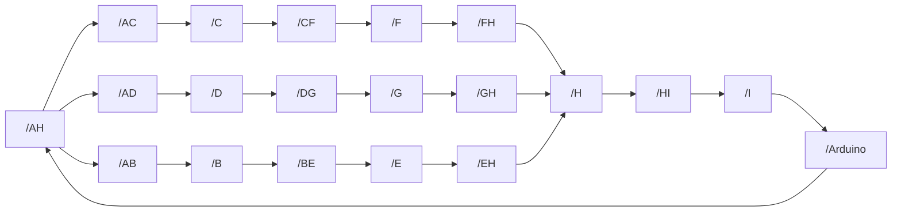

# Hi there, I'm Miguel Esteban Flores Sierra 👋
### Freelance Software Developer 👨‍💻

I am a software passionate and **Electronics Engineer** from Lima, Peru. With expertise in Python, Java, C#, C++, SQL, and Linux, I have over 4 years of experience in software and hardware design, specializing in innovative and impactful solutions for complex environments.

#### About Me 🙋‍♂️
- 🎓 Graduated from **Universidad Nacional Mayor de San Marcos**.
- 💼 Currently a **Software Analyst at PCI Energy Solutions**, ensuring optimal user experiences and contributing to the growth and innovation of our software offerings.
- 🛠️ Experienced in **multidisciplinary projects**, seamlessly integrating electronics with mechanical designs, primarily for robotics applications.

## My Skill Set  
<table><tr><td valign="top" width="50%">
    
### Frontend  

 
  
  
  
  

</td><td valign="top" width="50%">
    
### Backend  

  
  
  
  
  

</tr></table>  

# 🚀 Projects developed
## Demo-Whatsapp-Chatbot 
This repository hosts a Python-based demo chatbot designed to interact with a WhatsApp Business account via the Meta API. The project is organized for easy feature testing and streamlined deployment within a controlled environment.

*Image generated by OpenAI's DALL-E.*

## Flask E-commerce Web Application (_under development_ & private for now)
A Flask-based e-commerce app with a shopping cart, item editing, and order submission via /submit. It integrates with WhatsApp for order confirmations and offers real-time file editing for developers, making it ideal for small to medium-sized online stores.

## Bookstore_Flask (_under development_) 
Basic web application for a bookstore was developed using Flask, applying a layered architecture design pattern. The design focuses on separating concerns and improving maintainability by organizing the code into distinct layers.

## Quadrupedal_Robot (_under development_) 
This is a robotic project that aims to create a quadrupedal robot that can be controlled using a Raspberry Pi and ESP32 microcontroller. The robot will perform basic movements such as walking, turning, and stopping, and can be further extended with additional functionalities.

## ROS-node 
This project is part of a lab test to get you started on ROS nodes and arduino communication. All documentation has been taken from the ROS website and can be found there. It's highly recommended to install Arduino first and arduino ros serial node to work with it on ubuntu environment.

# 💻 Tech Stack:

  
  
  
  
  
  
  
  
  
  
  
  
  
  
  
  
  
  
  
  

  

   

# 📊 GitHub Stats:
<table><tr><td valign="top" width="50%">

</td><td valign="top" width="50%">

</td></tr></table>  

# 📞 How to contact me:

 
