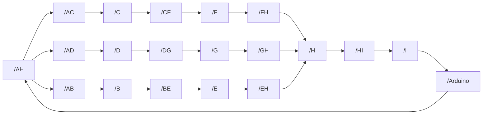

# Hi there, I'm Miguel Esteban Flores Sierra 👋
### Freelance Software Developer

I am a software passionate and **Electronics Engineer** from Lima, Peru. With expertise in Python, Java, C#, C++, SQL, and Linux, I have over 4 years of experience in software and hardware design, specializing in innovative and impactful solutions for complex environments.

#### About Me
- 🎓 Graduated from **Universidad Nacional Mayor de San Marcos**.
- 💼 Currently a **Software Analyst at PCI Energy Solutions**, ensuring optimal user experiences and contributing to the growth and innovation of our software offerings.
- 🛠️ Experienced in **multidisciplinary projects**, seamlessly integrating electronics with mechanical designs, primarily for robotics applications.

#### Skills
- 🐍 **Python, Java, C#, C++, SQL**
- 🛠️ **Data Analytics**, **Machine Learning**, and **Cybersecurity**
- 🖥️ **Linux Systems Administration**

# 💻 Tech Stack:
                  

# How to contact me:

 

# Some projects developed
## Flask E-commerce Web Application (_under development_ & private for now)
This project is a Flask-based web application designed for an e-commerce. It has a shopping cart, cart items editing and supports order submission via a `/submit` route, the application also provides an integration with WhatsApp for order confirmation with end user. It has real-time file editing feature (only visible with developer credentials), making it a versatile solution for small to medium-sized online stores. 

## Bookstore_Flask (_under development_) 
Simple bookstore web application built using Flask, following a layered architecture design pattern. The application is structured to separate concerns and improve maintainability by organizing code into different layers.

## Chatbot-Whatsapp-Meta 
Python script developed to test the functionality of a WhatsApp chatbot using Meta API and WhatsApp Business. The script is developed in Visual Studio Code and utilizes the Meta API for interacting with a WhatsApp Business test account.

## Quadrupedal_Robot (_under development_) 
This project aims to create a quadrupedal robot that can be controlled using a Raspberry Pi and ESP32 microcontrollers. The robot will perform basic movements such as walking, turning, and stopping, and can be further extended with additional functionalities.

## ROS-node 
This project is part of a lab test to get you started on ROS nodes and arduino communication. All documentation has been taken from the ROS website and can be found there. It's highly recommended to install Arduino first and arduino ros serial node to work with it on ubuntu environment.

# 📊 GitHub Stats:

